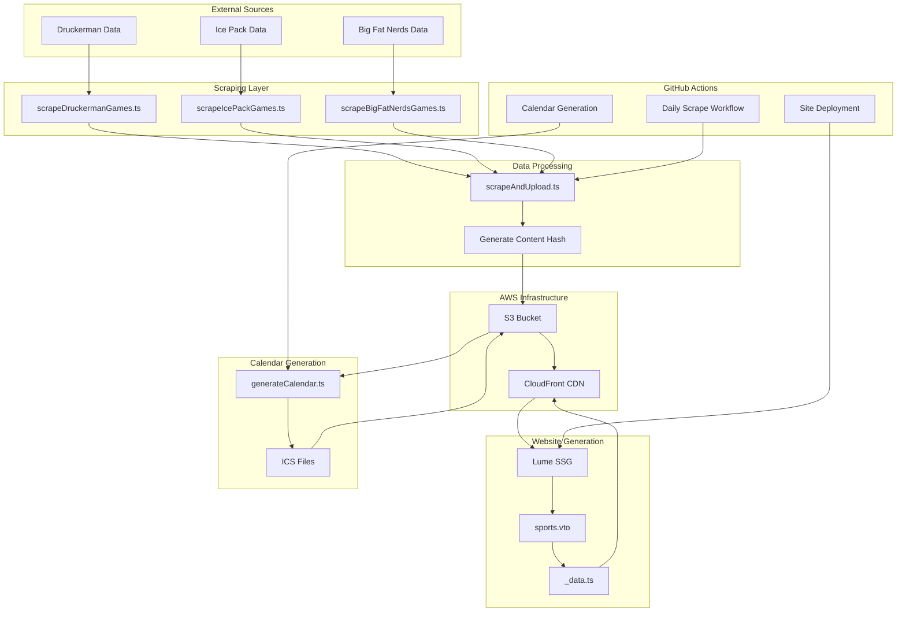
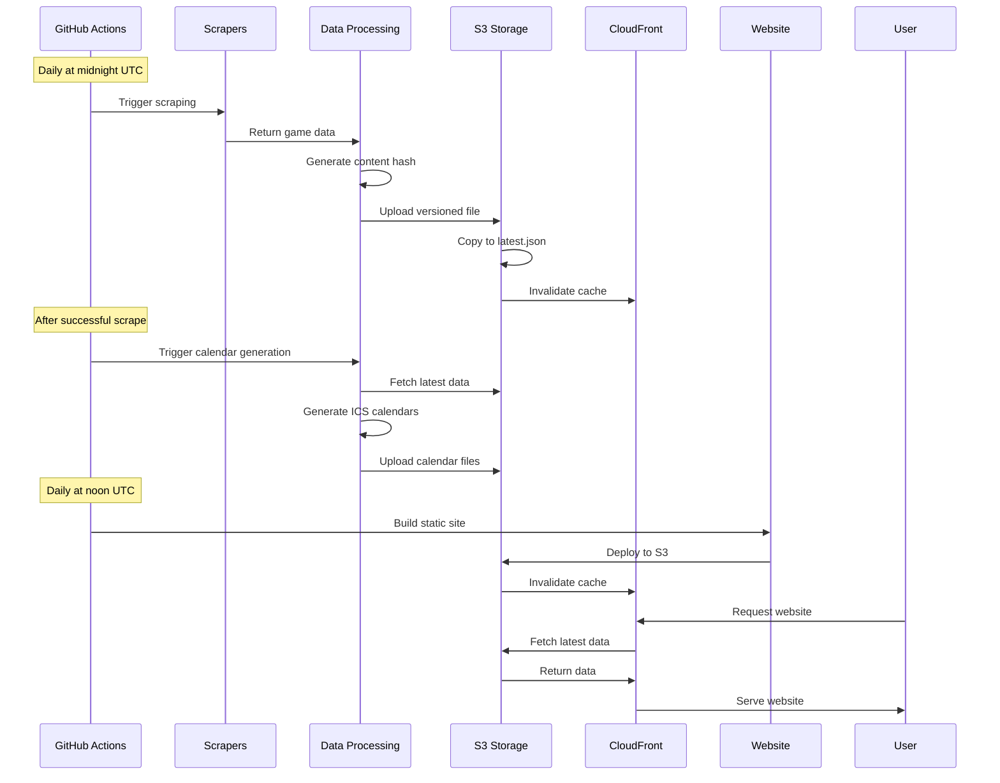
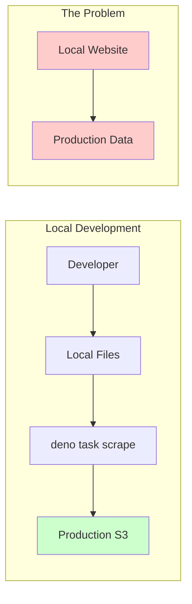
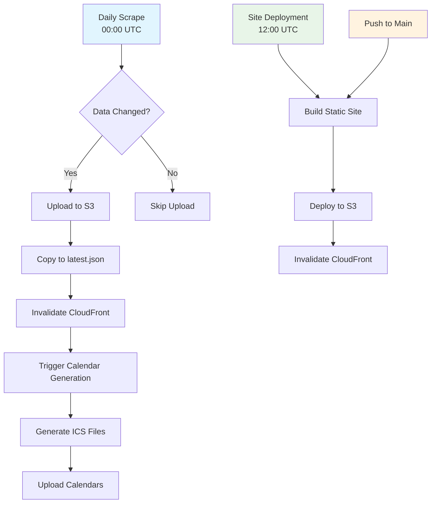

# Sports Scraper

A comprehensive sports schedule management system that scrapes game data from multiple sources, processes it, and serves it through a static website with calendar integration.

## 🏗️ Architecture Overview

This project consists of several interconnected components:

- **Data Scrapers**: Extract game schedules from various sources
- **Data Processing**: Normalize and process scraped data
- **Cloud Storage**: Store processed data in AWS S3
- **Static Site Generation**: Build website using Lume (Deno-based SSG)
- **Calendar Generation**: Create ICS calendar files for team schedules
- **Automated Deployment**: GitHub Actions for scheduled scraping and deployment

## 🔄 Data Flow

The system follows this data flow pattern:

```
External Sources → Scrapers → Data Processing → S3 Storage → Website Generation → CloudFront → Users
```

### Architecture Diagram



### Detailed Data Flow



### Local Development Flow



### Key Components

1. **Scrapers** (`src/utils/`)
   - `scrapeDruckermanGames.ts` - Scrapes Druckerman team data
   - `scrapeIcePackGames.ts` - Scrapes Ice Pack team data  
   - `scrapeBigFatNerdsGames.ts` - Scrapes Big Fat Nerds team data

2. **Data Processing** (`src/scrapeAndUpload.ts`)
   - Combines data from all scrapers
   - Generates content hash for change detection
   - Uploads to S3 with versioned filenames

3. **Website Generation** (`src/pages/`)
   - `sports.vto` - Main sports schedule page
   - `_data.ts` - Fetches data from S3 for page generation
   - Uses Lume static site generator

4. **Calendar Generation** (`src/generateCalendar.ts`)
   - Creates ICS calendar files for each team
   - Uploads calendars to S3

## 🚨 Important: Local Development Gotcha

**⚠️ CRITICAL**: Even when running locally, the website loads data from **production S3**, not local files!

This means:
- Changes to scraping scripts won't be visible in the UI until they're deployed to production
- The website at `http://localhost:3000` fetches data from `https://d1msdfi79mlr9u.cloudfront.net/hockey-games/latest.json`
- To see local changes, you need to either:
  1. Run the scraper locally and upload to S3, or
  2. Temporarily modify `src/pages/_data.ts` to use local data

## 📁 Project Structure

```
sports-scraper/
├── src/
│   ├── pages/              # Website pages and data processing
│   │   ├── sports.vto      # Main sports schedule page
│   │   └── _data.ts        # Data fetching for pages
│   ├── utils/              # Scraping utilities
│   │   ├── scrapeDruckermanGames.ts
│   │   ├── scrapeIcePackGames.ts
│   │   ├── scrapeBigFatNerdsGames.ts
│   │   └── s3.ts           # S3 upload/download utilities
│   ├── scrapeAndUpload.ts  # Main scraping orchestration
│   └── generateCalendar.ts # Calendar generation
├── frontend/               # React frontend (if used)
├── _site/                  # Generated static site
├── .github/workflows/      # GitHub Actions
└── _infra/                 # AWS CDK infrastructure
```

## 🛠️ Development Commands

```bash
# Run scraper locally
deno task scrape

# Generate calendar files
deno task calendar

# Build static site
deno task build

# Serve site locally (loads from prod S3!)
deno task serve

# Run tests
deno task test
```

## 🔄 Automated Workflows

### Daily Data Scraping
- **Trigger**: Daily at midnight UTC
- **Workflow**: `.github/workflows/scrape-hockey-data.yml`
- **Process**: 
  1. Scrapes all team data
  2. Generates content hash
  3. Uploads to S3 if data changed
  4. Copies to `latest.json`
  5. Invalidates CloudFront cache

### Calendar Generation
- **Trigger**: After successful data scraping
- **Workflow**: `.github/workflows/generate-calendar.yml`
- **Process**:
  1. Fetches latest data from S3
  2. Generates ICS calendars for each team
  3. Uploads calendars to S3

### Site Deployment
- **Trigger**: Daily at 12:00 PM UTC, or on push to main
- **Workflow**: `.github/workflows/deploy-site.yml`
- **Process**:
  1. Builds static site with Lume
  2. Builds React frontend
  3. Syncs to S3 bucket
  4. Invalidates CloudFront cache

### Workflow Dependencies



### Manual Triggers

All workflows support manual triggering via GitHub Actions UI:
- **Scrape Hockey Data**: Manual data refresh
- **Generate Calendar**: Manual calendar regeneration  
- **Deploy Site**: Manual site deployment

## 🏗️ Infrastructure

The project uses AWS infrastructure managed by CDK:

- **S3 Buckets**: 
  - Data storage (game data, calendars)
  - Static site hosting
- **CloudFront**: CDN for fast content delivery
- **Route 53**: DNS management
- **ACM**: SSL certificates

## 🔧 Environment Variables

Required environment variables:

```bash
# AWS Configuration
AWS_ACCESS_KEY_ID=your_access_key
AWS_SECRET_ACCESS_KEY=your_secret_key
AWS_REGION=us-east-1
AWS_BUCKET_NAME=files.davertron.com
DATA_CLOUDFRONT_DISTRIBUTION_ID=data-cf-distribution-id

# Site Configuration  
STATIC_SITE_BUCKET=davertron.com
SITE_CLOUDFRONT_DISTRIBUTION_ID=site-cf-distribution-id
```

## 🐛 Troubleshooting

### Why don't I see my changes in the UI?

1. **Check data source**: The website loads from production S3, not local files
2. **Run scraper**: Use `deno task scrape` to update production data
3. **Check CloudFront**: Cache might need invalidation
4. **Verify upload**: Check S3 bucket for new files

### Local Development Tips

1. **Test scrapers locally**: Use `deno task scrape` to verify scraping logic
2. **Check S3 uploads**: Verify data is being uploaded correctly
3. **Monitor CloudFront**: Check if cache invalidation is working
4. **Use browser dev tools**: Check network requests to see data source

### Common Development Issues

#### Issue: "I modified a scraper but don't see changes"
**Root Cause**: Local website loads from production S3, not local files
**Solutions**:
1. Run `deno task scrape` to upload changes to S3
2. Wait for CloudFront cache invalidation (usually immediate)
3. Hard refresh browser (Ctrl+F5)

#### Issue: "Data seems stale even after scraping"
**Root Cause**: CloudFront cache or S3 upload issues
**Solutions**:
1. Check S3 bucket for new files with timestamps
2. Verify CloudFront invalidation in AWS console
3. Check GitHub Actions logs for errors

#### Issue: "Calendar files not updating"
**Root Cause**: Calendar generation depends on successful data scraping
**Solutions**:
1. Ensure data scraping completed successfully
2. Manually trigger calendar generation workflow
3. Check S3 for calendar files in `hockey-calendar/` folder

#### Issue: "Site deployment failing"
**Root Cause**: Build errors or AWS permissions
**Solutions**:
1. Check GitHub Actions logs for specific errors
2. Verify AWS credentials and permissions
3. Test build locally with `deno task build`

### Development Workflow

For effective local development:

1. **Test scraping logic**:
   ```bash
   # Test individual scrapers
   deno run --allow-net src/utils/scrapeDruckermanGames.ts
   
   # Test full scraping pipeline
   deno task scrape
   ```

2. **Verify data upload**:
   ```bash
   # Check S3 bucket contents
   aws s3 ls s3://your-bucket/hockey-games/
   
   # Check latest.json
   aws s3 cp s3://your-bucket/hockey-games/latest.json - | jq .
   ```

3. **Test website locally**:
   ```bash
   # Build and serve (still loads from prod S3!)
   deno task build
   deno task serve
   ```

4. **Force cache invalidation**:
   ```bash
   # Invalidate CloudFront cache manually
   aws cloudfront create-invalidation --distribution-id YOUR_DISTRIBUTION_ID --paths "/*"
   ```

### Debugging Data Flow

Use these techniques to debug data flow issues:

1. **Check data source in browser**:
   - Open DevTools → Network tab
   - Look for requests to `d1msdfi79mlr9u.cloudfront.net/hockey-games/latest.json`
   - Verify response contains expected data

2. **Monitor S3 uploads**:
   ```bash
   # Watch S3 bucket for new files
   aws s3 ls s3://your-bucket/hockey-games/ --recursive --human-readable
   ```

3. **Check CloudFront logs**:
   - Enable CloudFront access logs
   - Monitor cache hit/miss ratios
   - Verify invalidation requests

4. **Test individual components**:
   ```bash
   # Test data fetching
   deno run --allow-net -e "console.log(await fetch('https://d1msdfi79mlr9u.cloudfront.net/hockey-games/latest.json').then(r => r.json()))"
   
   # Test calendar generation
   deno task calendar
   ```

## 📊 Data Sources

The system scrapes from multiple sources:

- **Druckerman**: Custom data source
- **Ice Pack**: Custom data source  
- **Big Fat Nerds**: Google Sheets integration

Each scraper normalizes data into a common `Game` interface with fields like:
- `team`: Team name
- `eventStartTime`: Game start time
- `eventEndTime`: Game end time
- `rink`: Location
- `opponent`: Opposing team
- `score`: Game result
- `cancelled`: Cancellation status

## 🚀 Deployment

The system is fully automated:

1. **Data Scraping**: Runs daily via GitHub Actions
2. **Calendar Generation**: Triggered after successful scraping
3. **Site Deployment**: Runs daily and on code changes
4. **Cache Invalidation**: Automatic CloudFront cache clearing

No manual intervention required for normal operations.

## 📋 Quick Reference

### Key Files
- `src/scrapeAndUpload.ts` - Main scraping orchestration
- `src/pages/sports.vto` - Main website page
- `src/pages/_data.ts` - Data fetching for website
- `src/generateCalendar.ts` - Calendar generation
- `.github/workflows/` - Automated workflows

### Key URLs
- **Production Data**: `https://d1msdfi79mlr9u.cloudfront.net/hockey-games/latest.json`
- **Calendars**: `https://d1msdfi79mlr9u.cloudfront.net/hockey-calendar/`
- **Website**: `https://davertron.com/sports/`

### Important Notes
- ⚠️ **Local development loads from production S3**
- 🔄 **Changes require running `deno task scrape`**
- 📅 **Calendars auto-generate after data updates**
- 🚀 **Site auto-deploys daily and on code changes**

## 🤝 Contributing

1. Make changes to scrapers or website code
2. Test locally with `deno task scrape`
3. Push to main branch
4. Monitor GitHub Actions for deployment
5. Verify changes on production site

## 📝 Changelog

- **v1.0**: Initial implementation with basic scraping
- **v1.1**: Added calendar generation
- **v1.2**: Added automated deployment
- **v1.3**: Added comprehensive documentation and diagrams
