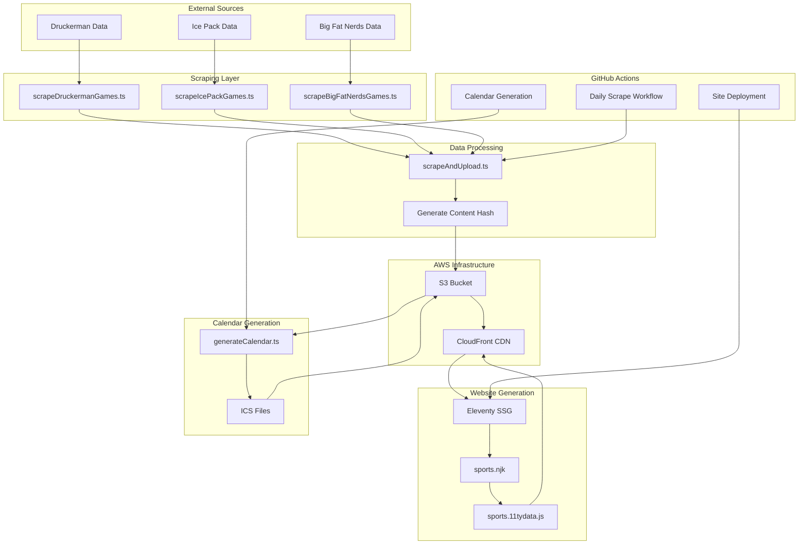
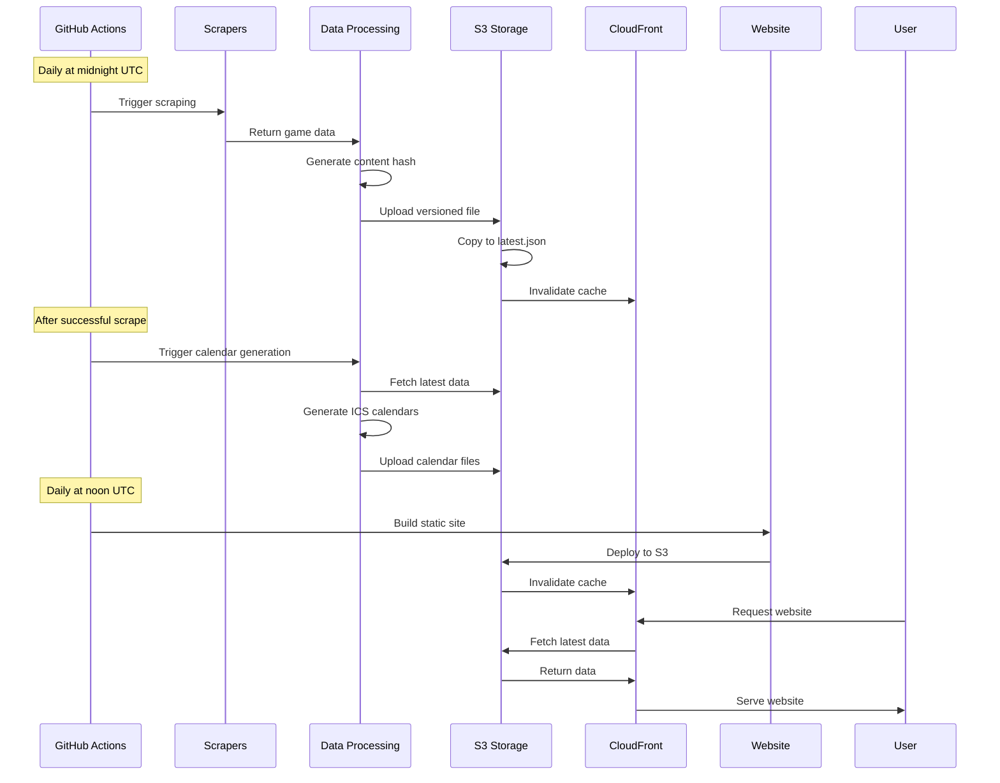
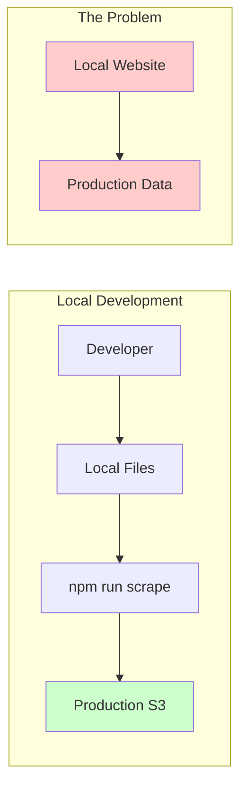
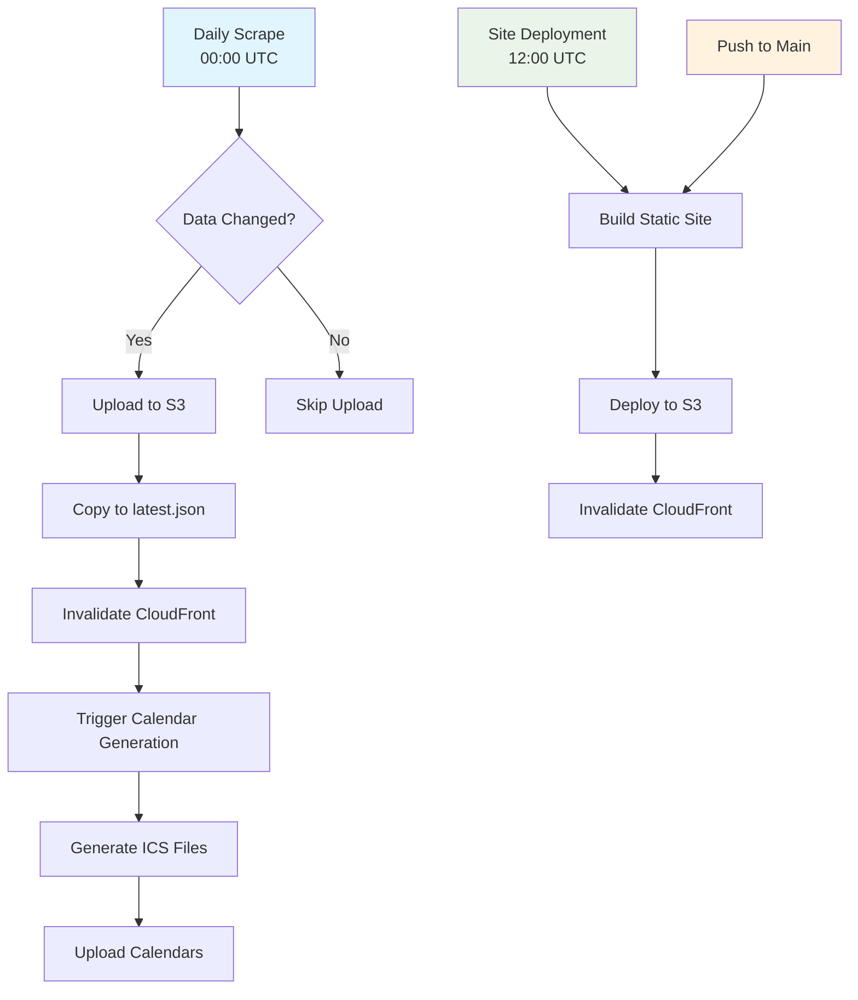

# Sports Scraper

A comprehensive sports schedule management system that scrapes game data from multiple sources, processes it, and serves it through a static website with calendar integration.

## 🏗️ Architecture Overview

This project consists of several interconnected components:

- **Data Scrapers**: Extract game schedules from various sources
- **Data Processing**: Normalize and process scraped data
- **Cloud Storage**: Store processed data in AWS S3
- **Static Site Generation**: Build website using Eleventy (Node-based SSG)
- **Calendar Generation**: Create ICS calendar files for team schedules
- **Automated Deployment**: GitHub Actions for scheduled scraping and deployment

## 🔄 Data Flow

The system follows this data flow pattern:

```
External Sources → Scrapers → Data Processing → S3 Storage → Website Generation → CloudFront → Users
```

### Architecture Diagram


```mermaid
graph TB
    subgraph "External Sources"
        DS[Druckerman Data]
        IS[Ice Pack Data]
        BS[Big Fat Nerds Data]
    end
    
    subgraph "Scraping Layer"
        SD[scrapeDruckermanGames.ts]
        SI[scrapeIcePackGames.ts]
        SB[scrapeBigFatNerdsGames.ts]
    end
    
    subgraph "Data Processing"
        SU[scrapeAndUpload.ts]
        HASH[Generate Content Hash]
    end
    
    subgraph "AWS Infrastructure"
        S3[S3 Bucket]
        CF[CloudFront CDN]
    end
    
    subgraph "Website Generation"
        ELEVENTY[Eleventy SSG]
        PAGES[sports.njk]
        DATA[sports.11tydata.js]
    end
    
    subgraph "Calendar Generation"
        CAL[generateCalendar.ts]
        ICS[ICS Files]
    end
    
    subgraph "GitHub Actions"
        SCRAPE[Daily Scrape Workflow]
        CALENDAR[Calendar Generation]
        DEPLOY[Site Deployment]
    end
    
    DS --> SD
    IS --> SI
    BS --> SB
    
    SD --> SU
    SI --> SU
    SB --> SU
    
    SU --> HASH
    HASH --> S3
    
    S3 --> CF
    CF --> ELEVENTY
    ELEVENTY --> PAGES
    PAGES --> DATA
    DATA --> CF
    
    S3 --> CAL
    CAL --> ICS
    ICS --> S3
    
    SCRAPE --> SU
    CALENDAR --> CAL
    DEPLOY --> ELEVENTY
```

### Detailed Data Flow


```mermaid
sequenceDiagram
    participant GH as GitHub Actions
    participant SCR as Scrapers
    participant PROC as Data Processing
    participant S3 as S3 Storage
    participant CF as CloudFront
    participant SITE as Website
    participant USER as User
    
    Note over GH: Daily at midnight UTC
    GH->>SCR: Trigger scraping
    SCR->>PROC: Return game data
    PROC->>PROC: Generate content hash
    PROC->>S3: Upload versioned file
    S3->>S3: Copy to latest.json
    S3->>CF: Invalidate cache
    
    Note over GH: After successful scrape
    GH->>PROC: Trigger calendar generation
    PROC->>S3: Fetch latest data
    PROC->>PROC: Generate ICS calendars
    PROC->>S3: Upload calendar files
    
    Note over GH: Daily at noon UTC
    GH->>SITE: Build static site
    SITE->>S3: Deploy to S3
    S3->>CF: Invalidate cache
    
    USER->>CF: Request website
    CF->>S3: Fetch latest data
    S3->>CF: Return data
    CF->>USER: Serve website
```

### Local Development Flow


```mermaid
graph LR
    subgraph "Local Development"
        DEV[Developer]
        LOCAL[Local Files]
        SCRAPE_LOCAL[npm run scrape]
        S3_PROD[Production S3]
    end
    
    subgraph "The Problem"
        SITE_LOCAL[Local Website]
        DATA_PROD[Production Data]
    end
    
    DEV --> LOCAL
    LOCAL --> SCRAPE_LOCAL
    SCRAPE_LOCAL --> S3_PROD
    SITE_LOCAL --> DATA_PROD
    
    style SITE_LOCAL fill:#ffcccc
    style DATA_PROD fill:#ffcccc
    style S3_PROD fill:#ccffcc
```

### Key Components

1. **Scrapers** (`src/utils/`)
   - `scrapeDruckermanGames.ts` - Scrapes Druckerman team data
   - `scrapeIcePackGames.ts` - Scrapes Ice Pack team data  
   - `scrapeBigFatNerdsGames.ts` - Scrapes Big Fat Nerds team data

2. **Data Processing** (`src/scrapeAndUpload.ts`)
   - Combines data from all scrapers
   - Generates content hash for change detection
   - Uploads to S3 with versioned filenames

3. **Website Generation** (`src/pages/`)
   - `sports.njk` - Main sports schedule page (Nunjucks template)
   - `sports.11tydata.js` - Fetches data from S3 and does the date/calendar math for `sports.njk`
   - Uses the Eleventy static site generator

4. **Calendar Generation** (`src/generateCalendar.ts`)
   - Creates ICS calendar files for each team
   - Uploads calendars to S3

## 🚨 Important: Local Development Gotcha

**⚠️ CRITICAL**: Even when running locally, the website loads data from **production S3**, not local files!

This means:
- Changes to scraping scripts won't be visible in the UI until they're deployed to production
- The website at `http://localhost:8080` (Eleventy's default dev server port) fetches data from `https://d1msdfi79mlr9u.cloudfront.net/hockey-games/latest.json`
- To see local changes, you need to either:
  1. Run the scraper locally and upload to S3, or
  2. Temporarily modify `src/pages/sports.11tydata.js` to use local data

## 📁 Project Structure

```
sports-scraper/
├── eleventy.config.js      # Eleventy (SSG) config
├── src/
│   ├── pages/               # Website pages (Eleventy input dir)
│   │   ├── _includes/       # layout.njk, icons.njk
│   │   ├── sports.njk       # Main sports schedule page
│   │   ├── sports.11tydata.js # Data fetching + calendar math for sports.njk
│   │   └── *.njk            # index, error, guitar, benchapp-import pages
│   ├── utils/                # Scraping utilities
│   │   ├── scrapeDruckermanGames.ts
│   │   ├── scrapeIcePackGames.ts
│   │   ├── scrapeBigFatNerdsGames.ts
│   │   └── s3.ts            # S3 upload/download utilities (aws4fetch)
│   ├── scrapeAndUpload.ts   # Main scraping orchestration
│   └── generateCalendar.ts # Calendar generation
├── frontend/                # Preact "guitar" app, built separately with Vite
├── static/                  # Assets + Tailwind source CSS, copied/compiled into _site/
├── _site/                   # Generated static site
├── .github/workflows/       # GitHub Actions
└── _infra/                  # AWS CDK infrastructure
```

## 🛠️ Development Commands

```bash
# Run scraper locally
npm run scrape

# Generate calendar files
npm run calendar

# Build static site (Eleventy + Tailwind CSS) -- needs `npm install` first,
# since Eleventy/Tailwind are devDependencies, not vendored (see below)
npm install
npm run build

# Serve site locally with live reload (loads from prod S3!)
npm run serve

# Run tests
npm test

# Type-check (needs `npm install` for @types/node and typescript)
npm run typecheck
```

`npm run scrape` and `npm run calendar` never need `npm install` -- their dependencies
(`aws4fetch`, `cheerio`) are vendored directly into `node_modules` in git. Eleventy and the
Tailwind CLI are *not* vendored (Tailwind ships platform-specific native binaries that can't be
safely committed), so building the site needs one `npm install` first.

## 🔄 Automated Workflows

### Daily Data Scraping
- **Trigger**: Daily at midnight UTC
- **Workflow**: `.github/workflows/scrape-hockey-data.yml`
- **Process**: 
  1. Scrapes all team data
  2. Generates content hash
  3. Uploads to S3 if data changed
  4. Copies to `latest.json`
  5. Invalidates CloudFront cache

### Calendar Generation
- **Trigger**: After successful data scraping
- **Workflow**: `.github/workflows/generate-calendar.yml`
- **Process**:
  1. Fetches latest data from S3
  2. Generates ICS calendars for each team
  3. Uploads calendars to S3

### Site Deployment
- **Trigger**: Daily at 12:00 PM UTC, or on push to main
- **Workflow**: `.github/workflows/deploy-site.yml`
- **Process**:
  1. Builds static site with Eleventy
  2. Builds Preact frontend (the "guitar" app)
  3. Syncs to S3 bucket
  4. Invalidates CloudFront cache

### Workflow Dependencies


```mermaid
graph TD
    A[Daily Scrape<br/>00:00 UTC] --> B{Data Changed?}
    B -->|Yes| C[Upload to S3]
    B -->|No| D[Skip Upload]
    C --> E[Copy to latest.json]
    E --> F[Invalidate CloudFront]
    F --> G[Trigger Calendar Generation]
    G --> H[Generate ICS Files]
    H --> I[Upload Calendars]
    
    J[Site Deployment<br/>12:00 UTC] --> K[Build Static Site]
    K --> L[Deploy to S3]
    L --> M[Invalidate CloudFront]
    
    N[Push to Main] --> K
    
    style A fill:#e1f5fe
    style J fill:#e8f5e8
    style N fill:#fff3e0
```

### Manual Triggers

All workflows support manual triggering via GitHub Actions UI:
- **Scrape Hockey Data**: Manual data refresh
- **Generate Calendar**: Manual calendar regeneration  
- **Deploy Site**: Manual site deployment

## 🏗️ Infrastructure

The project uses AWS infrastructure managed by CDK:

- **S3 Buckets**: 
  - Data storage (game data, calendars)
  - Static site hosting
- **CloudFront**: CDN for fast content delivery
- **Route 53**: DNS management
- **ACM**: SSL certificates

## 🔧 Environment Variables

Required environment variables:

```bash
# AWS Configuration
AWS_ACCESS_KEY_ID=your_access_key
AWS_SECRET_ACCESS_KEY=your_secret_key
AWS_REGION=us-east-1
AWS_BUCKET_NAME=files.davertron.com
DATA_CLOUDFRONT_DISTRIBUTION_ID=data-cf-distribution-id

# Site Configuration  
STATIC_SITE_BUCKET=davertron.com
SITE_CLOUDFRONT_DISTRIBUTION_ID=site-cf-distribution-id
```

Also required: the machine running `npm run scrape` must have its system timezone set to
**America/New_York**. Most date handling is explicitly zone-aware (via `Temporal`), but a couple
of spots (`overrideGames.ts`'s hardcoded score overrides) intentionally match on the system's
local calendar day rather than a fixed zone, mirroring the previous date-fns behavior. Wrong
system TZ on a runner would make those overrides silently stop matching.

## 🐛 Troubleshooting

### Why don't I see my changes in the UI?

1. **Check data source**: The website loads from production S3, not local files
2. **Run scraper**: Use `npm run scrape` to update production data
3. **Check CloudFront**: Cache might need invalidation
4. **Verify upload**: Check S3 bucket for new files

### Local Development Tips

1. **Test scrapers locally**: Use `npm run scrape` to verify scraping logic
2. **Check S3 uploads**: Verify data is being uploaded correctly
3. **Monitor CloudFront**: Check if cache invalidation is working
4. **Use browser dev tools**: Check network requests to see data source

### Common Development Issues

#### Issue: "I modified a scraper but don't see changes"
**Root Cause**: Local website loads from production S3, not local files
**Solutions**:
1. Run `npm run scrape` to upload changes to S3
2. Wait for CloudFront cache invalidation (usually immediate)
3. Hard refresh browser (Ctrl+F5)

#### Issue: "Data seems stale even after scraping"
**Root Cause**: CloudFront cache or S3 upload issues
**Solutions**:
1. Check S3 bucket for new files with timestamps
2. Verify CloudFront invalidation in AWS console
3. Check GitHub Actions logs for errors

#### Issue: "Calendar files not updating"
**Root Cause**: Calendar generation depends on successful data scraping
**Solutions**:
1. Ensure data scraping completed successfully
2. Manually trigger calendar generation workflow
3. Check S3 for calendar files in `hockey-calendar/` folder

#### Issue: "Site deployment failing"
**Root Cause**: Build errors or AWS permissions
**Solutions**:
1. Check GitHub Actions logs for specific errors
2. Verify AWS credentials and permissions
3. Test build locally with `npm install && npm run build`

### Development Workflow

For effective local development:

1. **Test scraping logic**:
   ```bash
   # Test an individual scraper directly (e.g. Big Fat Nerds)
   node src/utils/scrapeBigFatNerdsGames.ts

   # Test full scraping pipeline
   npm run scrape
   ```

2. **Verify data upload**:
   ```bash
   # Check S3 bucket contents
   aws s3 ls s3://your-bucket/hockey-games/
   
   # Check latest.json
   aws s3 cp s3://your-bucket/hockey-games/latest.json - | jq .
   ```

3. **Test website locally**:
   ```bash
   # Build and serve (still loads from prod S3!)
   npm install
   npm run build
   npm run serve
   ```

4. **Force cache invalidation**:
   ```bash
   # Invalidate CloudFront cache manually
   aws cloudfront create-invalidation --distribution-id YOUR_DISTRIBUTION_ID --paths "/*"
   ```

### Debugging Data Flow

Use these techniques to debug data flow issues:

1. **Check data source in browser**:
   - Open DevTools → Network tab
   - Look for requests to `d1msdfi79mlr9u.cloudfront.net/hockey-games/latest.json`
   - Verify response contains expected data

2. **Monitor S3 uploads**:
   ```bash
   # Watch S3 bucket for new files
   aws s3 ls s3://your-bucket/hockey-games/ --recursive --human-readable
   ```

3. **Check CloudFront logs**:
   - Enable CloudFront access logs
   - Monitor cache hit/miss ratios
   - Verify invalidation requests

4. **Test individual components**:
   ```bash
   # Test data fetching
   node -e "fetch('https://d1msdfi79mlr9u.cloudfront.net/hockey-games/latest.json').then(r => r.json()).then(console.log)"
   
   # Test calendar generation
   npm run calendar
   ```

## 📊 Data Sources

The system scrapes from multiple sources:

- **Druckerman**: Custom data source
- **Ice Pack**: Custom data source  
- **Big Fat Nerds**: Google Sheets integration

Each scraper normalizes data into a common `Game` interface with fields like:
- `team`: Team name
- `eventStartTime`: Game start time
- `eventEndTime`: Game end time
- `rink`: Location
- `opponent`: Opposing team
- `score`: Game result
- `cancelled`: Cancellation status

## 🚀 Deployment

The system is fully automated:

1. **Data Scraping**: Runs daily via GitHub Actions
2. **Calendar Generation**: Triggered after successful scraping
3. **Site Deployment**: Runs daily and on code changes
4. **Cache Invalidation**: Automatic CloudFront cache clearing

No manual intervention required for normal operations.

## 📋 Quick Reference

### Key Files
- `src/scrapeAndUpload.ts` - Main scraping orchestration
- `src/pages/sports.njk` - Main website page
- `src/pages/sports.11tydata.js` - Data fetching + calendar math for the website
- `src/generateCalendar.ts` - Calendar generation
- `.github/workflows/` - Automated workflows

### Key URLs
- **Production Data**: `https://d1msdfi79mlr9u.cloudfront.net/hockey-games/latest.json`
- **Calendars**: `https://d1msdfi79mlr9u.cloudfront.net/hockey-calendar/`
- **Website**: `https://davertron.com/sports/`

### Important Notes
- ⚠️ **Local development loads from production S3**
- 🔄 **Changes require running `npm run scrape`**
- 📅 **Calendars auto-generate after data updates**
- 🚀 **Site auto-deploys daily and on code changes**
- 🧰 **The whole stack runs on Node 26+ now** (see `.nvmrc`) -- Temporal (native date/time, no more date-fns/luxon), and Eleventy replacing the old Deno-based Lume SSG.

## 📝 Changelog

- **v1.0**: Initial implementation with basic scraping
- **v1.1**: Added calendar generation
- **v1.2**: Added automated deployment
- **v1.3**: Added comprehensive documentation and diagrams
- **v2.0**: Migrated off Deno entirely -- scraper pipeline and site build (Lume → Eleventy) now run on Node 26 + Temporal; dependencies minimized and vendored where safe to do so
